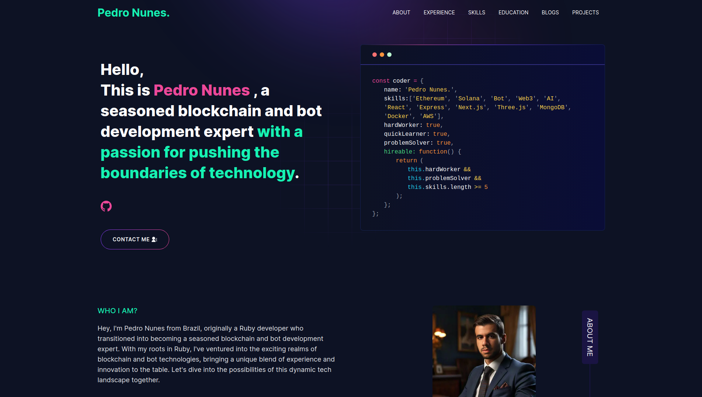

# [Built Portfolio With GitHub ](https://github.com/pedronunes1207/pedroportfolio.git)

---

# Code Wizardry and Bot Banter: Unveiling My Digital Lair

### Impressive! As a blockchain and bot expert, I bring a wealth of knowledge and experience to the table. With a deep understanding of blockchain technology and expertise in bot development, I am well-equipped to tackle a wide range of projects in these domains. Whether it's building decentralized applications, smart contracts, or designing intelligent chatbots, I am committed to delivering innovative solutions tailored to meet your specific needs. Let's leverage the power of blockchain and automation to drive your project forward!

---

# Demo



## View live preview [here](https://pedroportfolio.vercel.app/).

---

## Table of Contents :scroll:

- [Sections](#sections-bookmark)
- [Demo](#demo-movie_camera)
- [Installation](#installation-arrow_down)
- [Getting Started](#getting-started-dart)
- [Usage](#usage-joystick)
- [Packages Used](#packages-used-package)

---

# Sections :bookmark:

- HERO SECTION
- ABOUT ME
- EXPERIENCE
- SKILLS
- PROJECTS
- EDUCATION

---

# Installation :arrow_down:

### You will need to download Git and Node to run this project

- [Git](https://git-scm.com/downloads)
- [Node](https://nodejs.org/en/download/)

#### Make sure you have the latest version of both Git and Node on your computer.

```
node --version
node v18.20.2 npm 10.5.0

git --version
```

## <br />

# Getting Started :dart:

### Fork and Clone the repo

To Fork the repo click on the fork button at the top right of the page. Once the repo is forked open your terminal and perform the following commands

```
git clone https://github.com/<YOUR GITHUB USERNAME>/<YOUR GITHUB REPOSITORYNAME>

cd <YOUR GITHUB REPOSITORYNAME>
```

### Install packages from the root directory

```bash
npm install
# or
yarn install
```

Then, run the development server:

```bash
npm run dev
# or
yarn dev
```

Open [http://localhost:3000](http://localhost:3000) with your browser to see the result.

---

---

---

# Packages Used :package:

| Used Package List  |
| :----------------: |
|        next        |
|  @emailjs/browser  |
|    lottie-react    |
| react-fast-marquee |
|    react-icons     |
|   react-toastify   |
|        sass        |
|    tailwindcss     |

---
